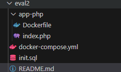
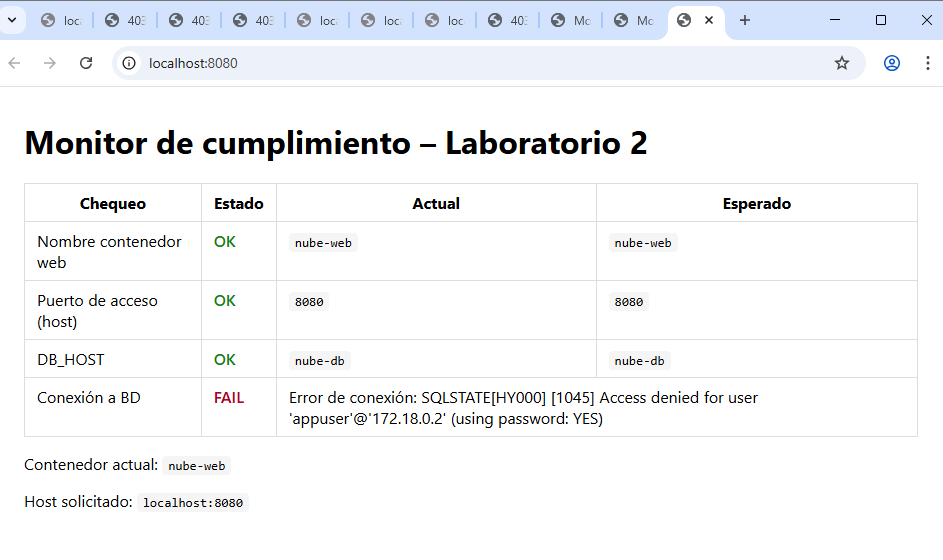
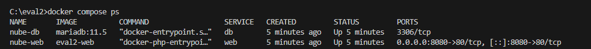

- Proyecto completo con estructura exacta. 
 
- Captura del monitor web mostrando todos los indicadores en **OK**, incluyendo la nueva tabla creada. 
 
- Salida de `docker compose ps`.  

- Fragmento de logs de salud (`healthcheck`) de la base de datos.  
- Comandos utilizados para crear e insertar en la nueva tabla.  
- Archivo `README.md` con instrucciones reproducibles (inicio, detención, backup, restore).